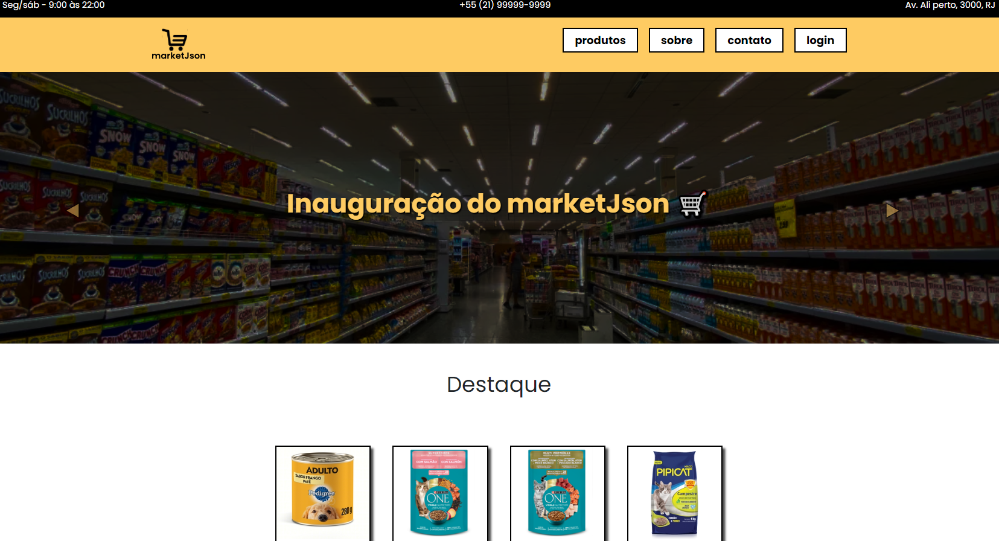
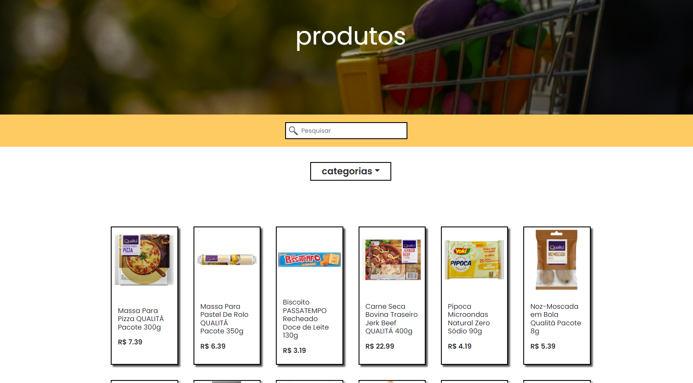
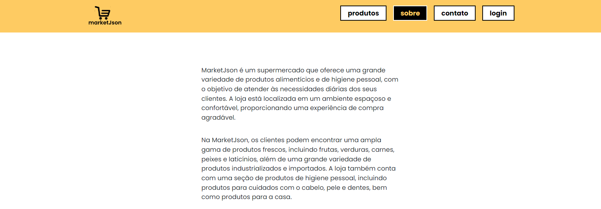
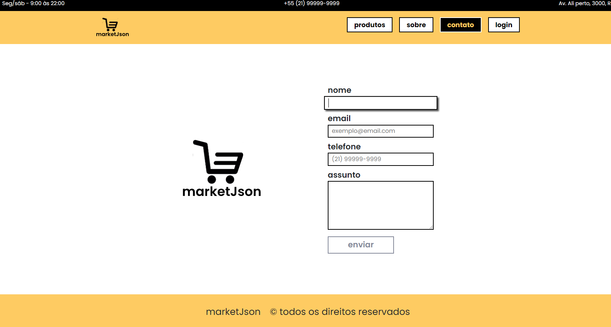
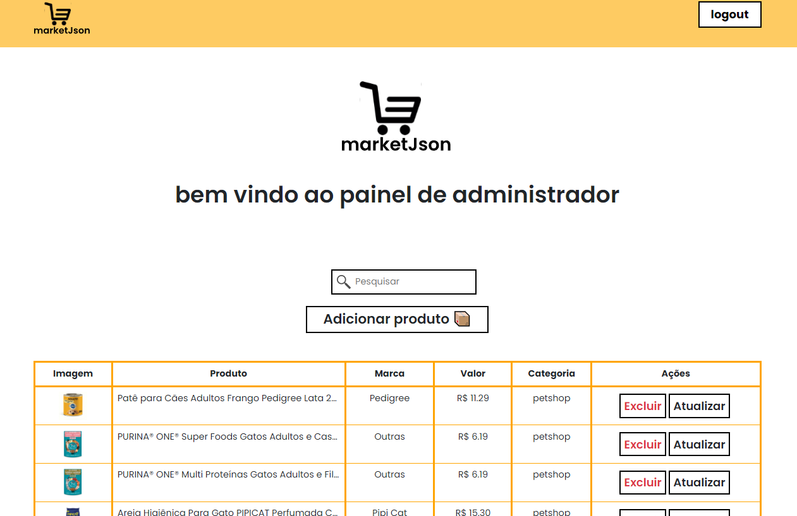

## Projetos finais case 2 🚀

## Tema

> MERCADO

Descrição:

> Criar um site que venda o projeto do Case 1..
> O conteúdo das páginas sobre e funcionalidades deve ser consultado de uma API..
> Para realizar a edição serão criadas rotas /admin.
> O front-end deve ser feito utilizando React e Bootstrap.
> O back-end deve ser feito utilizando Node, Express e SQLite(CASE 1)

## Dependências

[Node.js](https://nodejs.org/en/)

[Json-Server](https://github.com/typicode/json-server) para o fake database em json.

[Concurrently](https://www.npmjs.com/package/concurrently) executa vários comandos simultaneamente como `npm run dev & json-server`

> Exemplo: `"start": "concurrently \"npm run dev\" \"json-server --watch db.json\""`

[React-Bootstrap](https://react-bootstrap.github.io/) O modelo de componente React nos dá mais controle sobre a forma e a função de cada componente.

[Axios](https://axios-http.com/ptbr/) Axios é um cliente HTTP baseado em promessas para o node.js e para o navegador

[React-router-dom](https://reactrouter.com/en/main) O React Router permite roteamento do lado do cliente

<br>

## Uso

Clone o projeto

```bash
  git clone https://github.com/nobrupsiq/Projetos-finais-CASE2
```

Entre no diretório do projeto

```bash
  cd Projetos-finais-CASE2
```

Instale as dependências

```bash
npm install
```

Inicie o servidor

```bash
npm start
```

<br>

## ✔ Stack utilizada

-  **Front-end:** React, Bootstrap

-  **Back-end:** Node, Json-Server

<br>

## Screenshots







<br>
.
